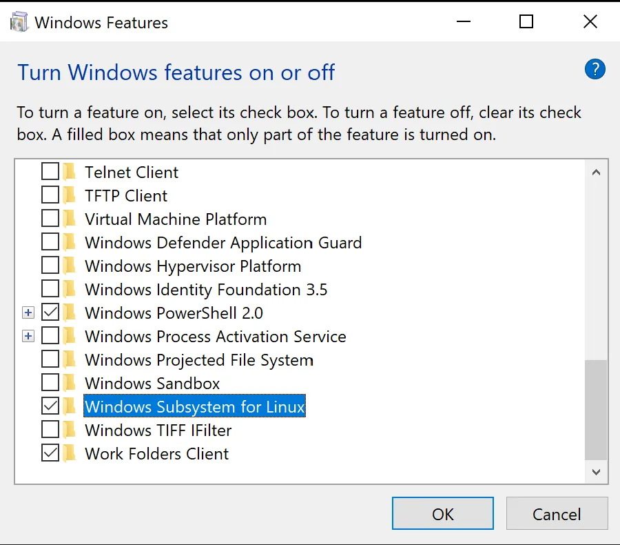
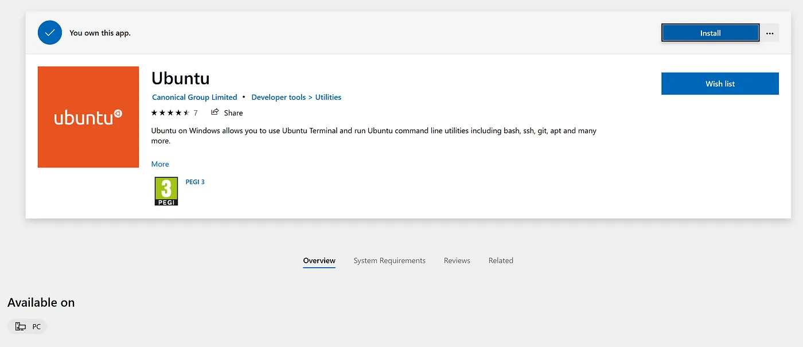
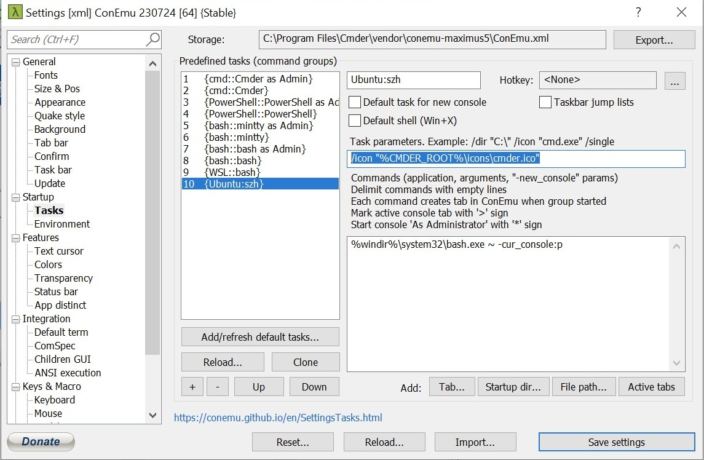
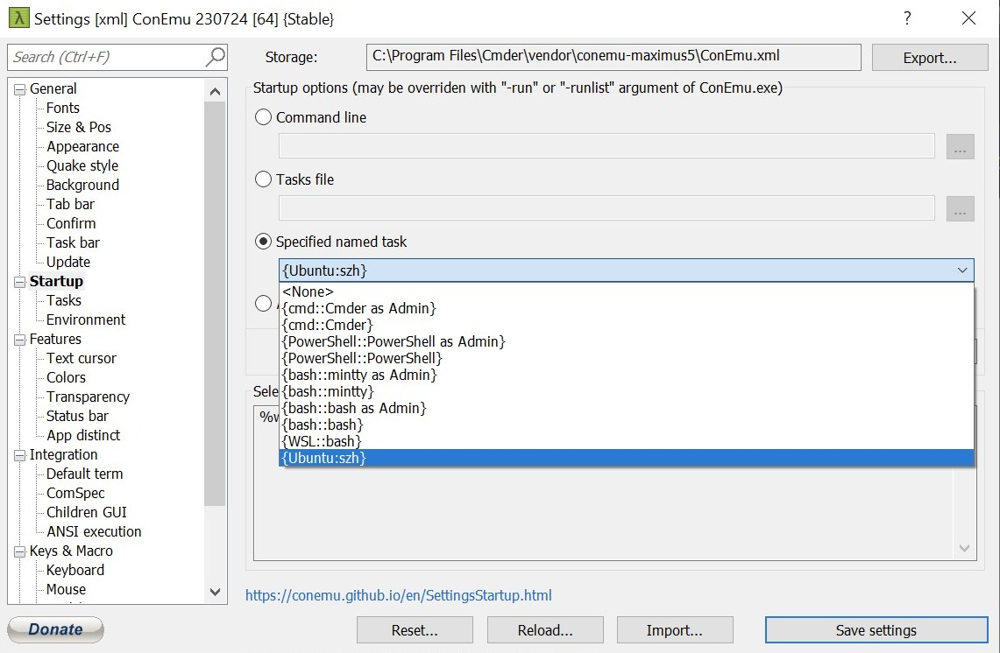
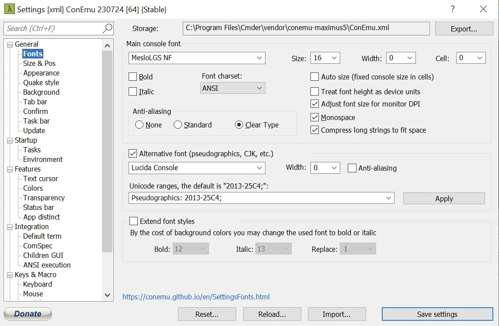

# Table of Contents

1. [Common Configurations](#common-configurations)
    - [Git Configuration](#git-configuration)
        - [Generating a new SSH key and adding it to the ssh-agent](#generating-a-new-ssh-key-and-adding-it-to-the-ssh-agent-httpsdocsgithubcomenauthenticationconnecting-to-github-with-sshgenerating-a-new-ssh-key-and-adding-it-to-the-ssh-agent)
        - [Setup Password Less SSH](#setup-passwordless-ssh-login)
        - [Install OhMyZsh](#install-ohmyzsh)
            - [OhMyZSH Recommended Configuration](#ohmyszh-recommended-configuration)
        - [Setup Powerlevel10k Theme](#setup-powerlevel10k-theme)
2. Fedora Server Configuration Snippets
3. Ubuntu Server Configuration Snippets
4. [macOS Configuration Snippets](#macos)
    - [Automount NFS](#automount-nfs)
    - [Install Homebrew](#install-homebrew)
    - [Installing packages using Brewfiles](#installing-packages-using-brewfile)
        - [Creating a new Brewfile](#creating-a-new-brewfile)
    - [Install Bat](#install-bat)
    - [Install Cakebrew](#install-cakebrew)
    - [Cheatsheet](#cheatsheet)
    - Install Parallels Tools
5. [Others](#others)
    - [Proxmox VE Download Backup Files](#proxmox-downloadupload-backup-files)
    - [Install Youtube-DL](#install-youtube-dl)
    - [Setting up Cmder + WSL2 + zsh](#setting-up-cmder--wsl2--szh-windows)
6. [Docker Containers](#docker-containers)
    - [Radarr](#radarr)
    - [Sonar-Extended](#sonar-extended)
    - [Radar-Extended](#radarr-extended)
    - [Deluge](#deluge)
    - [Portainer](#portainer)
    - [FlareSolverr](#flaresolverr)

## Common Configurations

### Git Configuration

```zsh
$ git config --global user.name "<your_name>"
$ git config --global user.email <your_email>
$ git config --global pull.rebase false
$ git config --global core.editor nano
```

### [Generating a new SSH key and adding it to the ssh-agent](https://docs.github.com/en/authentication/connecting-to-github-with-ssh/generating-a-new-ssh-key-and-adding-it-to-the-ssh-agent)

- Open Terminal.
- Paste the text below, substituting in your GitHub email address.

```bash
$ ssh-keygen -t ed25519 -C <your_email@example.com>
```

- Start the `ssh-agent` in the background.

```bash
$ eval "$(ssh-agent -s)"
> Agent pid 59566
```

> Note: If you're using macOS Sierra 10.12.2 or later, you will need to modify your ~/.ssh/config file to automatically
> load keys into the ssh-agent and store passphrases in your keychain.

- First, check to see if your ~/.ssh/config file exists in the default location.

```bash
$ open ~/.ssh/config
> The file /Users/YOU/.ssh/config does not exist.
```

- If the file doesn't exist, create the file.

```bash
$ touch ~/.ssh/config
```

- Open your `~/.ssh/config` file, then modify the file to contain the following lines. If your SSH key file has a
  different name or path than the example code, modify the filename or path to match your current setup.

```bash
Host github.com
  AddKeysToAgent yes
  UseKeychain yes
  IdentityFile ~/.ssh/id_ed25519
```

- Add your SSH private key to the `ssh-agent` and store your passphrase in the keychain. If you created your key with a
  different name, or if you are adding an existing key that has a different name, replace `id_ed25519` in the command
  with the name of your private key file.

```bash
$ ssh-add --apple-use-keychain ~/.ssh/id_ed25519
```

### [Setup Passwordless SSH Login](https://linuxize.com/post/how-to-setup-passwordless-ssh-login/)

- Check for existing SSH key pairs. If there are existing keys, you can either use those and skip the next step or
- Backup up the old keys and generate a new one.

```zsh
ls -al ~/.ssh/id_*.pub
```

- Configure your SSH keys (this step can be omitted if you have some keys already and do not want to generate new ones)

```sh
ssh-keygen -t ed25519 -C "<your_email>"
```

- Copy the keys to the server:

```bash
ssh-copy-id -i <path_to_your_ssh_private_key> <remote_username>@<server_ip_address>
```

### Install [OhMyZsh](https://github.com/ohmyzsh/ohmyzsh)

> Note: Latest version macOS comes with ZSH installed

```zsh
$ sudo dnf install zsh # Fedora
$ sudo apt install zsh # Ubuntu

$ chsh -s $(which zsh) # You must log out from your user session and log back in to see this change
$ sh -c "$(wget -O- https://raw.githubusercontent.com/ohmyzsh/ohmyzsh/master/tools/install.sh)"
```

#### OhMySZH Recommended Configuration

> Note: this is a custom configuration feel free to modify it as needed

```zsh
# ~/.zshrc
zstyle ':omz:update' mode auto
zstyle ':omz:update' frequency 15

plugins=(
  git
  gitfast
  common-aliases
  ssh-agent
  brew
  copypath
  copyfile
  cp
  macos
  node
  nvm
  docker
  docker-compose
)

 # Preferred editor for local and remote sessions
if [[ -n $SSH_CONNECTION ]]; then
  export EDITOR='nano'
else
  export EDITOR='nano'
fi

# The above lines should be added by PowerLevel10k theme when it gets install
source ~/powerlevel10k/powerlevel10k.zsh-theme
# To customize prompt, run `p10k configure` or edit ~/.p10k.zsh.
[[ ! -f ~/.p10k.zsh ]] || source ~/.p10k.zsh

# https://github.com/ohmyzsh/ohmyzsh/tree/master/plugins/ssh-agent
zstyle :omz:plugins:ssh-agent agent-forwarding on
zstyle :omz:plugins:ssh-agent identities <your_identity_private_file>
zstyle :omz:plugins:ssh-agent quiet yes

# User configuration
source $ZSH/oh-my-zsh.sh
source ~/.zshrc_alias

---
# ~/.zshrc_alias
# shellcheck shell=bash

alias myip="curl https://ipecho.net/plain; echo"
alias cat="bat"
```

### Setup [Powerlevel10k](https://github.com/romkatv/powerlevel10k#oh-my-zsh) Theme

```zsh
$ git clone --depth=1 https://gitee.com/romkatv/powerlevel10k.git ${ZSH_CUSTOM:-$HOME/.oh-my-zsh/custom}/themes/powerlevel10k
```

Close and reopen your terminal or use `omz-reload` to reload the OhMyZSH configuration, and you should be walked through
the theme setup process, upon finish you should be able to see the following lines in your `~/.zshrc` configuration (
normally it gets added at the very end of the file)

```zsh
source ~/powerlevel10k/powerlevel10k.zsh-theme
# To customize prompt, run `p10k configure` or edit ~/.p10k.zsh.
[[ ! -f ~/.p10k.zsh ]] || source ~/.p10k.zsh
```

If the above does not work for you, you can try set `ZSH_THEME="powerlevel10k/powerlevel10k"` in `~/.zshrc` and restart
your Terminal or use `omz-reload` to get changes loaded.

## macOS

### [Automount NFS](https://jswheeler.medium.com/nfs-automount-macos-montery-1a8bef92d994)

- Update the `/etc/auto_master` file as follows.
    ```zsh
    # ALWAYS create a copy of your original file
    sudo cp /etc/auto_master /etc/auto_master.ori
  
    #
    # Automounter master map
    #
    +auto_master  # Use directory service
    #/net   -hosts  -nobrowse,hidefromfinder,nosuid
    /home   auto_home -nobrowse,hidefromfinder
    /Network/Servers -fstab
    /-   -static
    /-   auto_nfs -soft,nobrowse,nosuid
    ```
  This creates a direct map with entries in the file /etc/auto_nfs.

  > **Hard mount:** If the NFS file system is hard mounted, the NFS daemons try repeatedly to contact the server. The
  NFS daemon retries will not time out, they affect system performance, and you cannot interrupt them, but control
  returns to the client when the nfstimeout value is reached.

- Create the target directories the remote NFS points will attach to.
    ```zsh
    # Repeat the below line as many times as needed
    sudo mkdir -p /System/Volumes/Data/<folder_name>
    ```
- Add the following lines to the `/etc/auto_nfs` file.
    ```zsh
    # ALWAYS create a copy of your original file
    sudo cp /etc/auto_nfs /etc/auto_nfs.ori
    
    # Repeat the below line as many times as needed
    /System/Volumes/Data/HomeOfficeNAS/Downloads -fstype=nfs,soft,resvport,rw,noowners <server_ip_address>:/<shared_folder>
   ```

- List the mounts provided:
    ```zsh
    showmount  -e <server_ip_address>
    ```

- Mount the remote endpoints:
    ```zsh
    sudo automount -v
    ```
  #### Finding your mount points

  You may want a friendly path to the mount point. /System/Volume/Data/<folder_name> is not easy for me to remember and
  is preferable to have something mount at `/`. This is where `/etc/synthetic.conf` comes in. A few notes about
  synthetics:

  > SYNTHETIC ENTITIES: Synthetic entities may not be deleted at runtime. In order to delete a synthetic entity, it must
  be removed from synthetic.conf, and the host must be rebooted. New files and directories may not be created within a
  synthetic empty directory.

  > FORMAT: synthetic.conf specifies a single synthetic entity per line. Each line may have one or two columns,
  separated by a tab character. If a line has a single column, it denotes a virtual empty directory to be created at /.
  If a line has two columns, it denotes a symbolic link at / whose link target is given in the second column.

  In either case, the first column denotes the name of the entity to be created at `/`.

  Modify the `/etc/synthetic.conf` file as follows:

    ```zsh
    # ALWAYS create a copy of your original file
    sudo cp /etc/synthetic.conf /etc/synthetic.conf.ori
    
    <folder_name>^ISystem/Volumes/Data/<folder_name>
    ```

  Check if the content is correct using `cat -t /etc/synthetic.conf`.

  > The cat -t command prints non-printable characters. The ^I is a tab character.

### [Install Homebrew](https://brew.sh/)

Open your terminal ([iTerm](https://iterm2.com/) suggested) and run the following command:

```zsh
$  /bin/bash -c "$(curl -fsSL https://raw.githubusercontent.com/Homebrew/install/HEAD/install.sh)"
```

Run these two commands in your terminal to add Homebrew to your PATH:

```zsh
$ (echo; echo 'eval "$(/opt/homebrew/bin/brew shellenv)"') >> /Users/reynierperez/.zprofile
$ eval "$(/opt/homebrew/bin/brew shellenv)"
```

### Installing packages using Brewfile

> Note: you can use the included file from this repository and adjust it according your needs or create a brand
> new `Brewfile`
> Go to the directory where the `Brewfile` is located and run the following command:

```zhs
brew bundle
```

#### Creating a new Brewfile

Go to the directory where you want to create the file and run the below command, a new file named `Brewfile` will be
created containing all your installed packages

```bash
brew bundle dump
```

### [Install Cakebrew](https://www.cakebrew.com)

```zsh
$ brew install cakebrew
```

### [Install Bat](https://formulae.brew.sh/formula/bat)

```zsh
$ brew install bat
```

> Note: For Linux check [this docs](https://www.linode.com/docs/guides/how-to-install-and-use-the-bat-command-on-linux)

### Cheatsheet

1. Copy file content to clipboard

```zsh
$ pbcopy < file.txt
```

You can check if the content is there by using the "pbpaste" command:

```bash
$ pbpaste
```

## Others

### [Proxmox Download/Upload Backup Files](https://forum.proxmox.com/threads/how-to-download-upload-backup-files.127656/)

- Log into your machine and read your file `/etc/pve/storage.cfg` to check where PVE is storing the backup files:

```zsh
$ cat /etc/pve/storage.cfg
dir: local
	path /var/lib/vz
	content iso,vztmpl,backup
lvmthin: local-lvm
	thinpool data
	vgname pve
	content rootdir,images

zfspool: zfs_disk
	pool zfs_disk
	content rootdir,images
	mountpoint /zfs_disk
	nodes pve
```

- Go to the directory `/var/lib/vz` and list the contents:

```zsh
$ cd /var/lib/vz/dump/
$ ls -l
total 18618116
-rw-r--r-- 1 root root        1078 May 18 21:15 vzdump-qemu-101-2023_05_18-21_15_44.log
-rw-r--r-- 1 root root        4087 May 25 10:24 vzdump-qemu-101-2023_05_25-10_22_26.log
-rw-r--r-- 1 root root  6590814742 May 25 10:24 vzdump-qemu-101-2023_05_25-10_22_26.vma.zst
-rw-r--r-- 1 root root           7 May 25 10:24 vzdump-qemu-101-2023_05_25-10_22_26.vma.zst.notes
-rw-r--r-- 1 root root        3596 May 18 21:15 vzdump-qemu-103-2023_05_18-21_07_33.log
-rw-r--r-- 1 root root        5962 May 25 17:50 vzdump-qemu-103-2023_05_25-17_47_05.log
-rw-r--r-- 1 root root 12474096384 May 25 17:50 vzdump-qemu-103-2023_05_25-17_47_05.vma.zst
-rw-r--r-- 1 root root          13 May 25 17:50 vzdump-qemu-103-2023_05_25-17_47_05.vma.zst.notes
```

- Copy the files from your machine

```bash
# if you are using macOS
# option 1
scp proxmox:/var/lib/vz/dump/. .
scp -r <user>@<ip_address>:/var/lib/vz/dump/. .

# if you are using Linux/macOS
scp proxmox:/var/lib/vz/dump/\* .
```

### Install Youtube-DL

```bash
# symlinks /usr/bin/python to python3
sudo apt update && sudo apt install python-is-python3

sudo curl -L https://yt-dl.org/downloads/latest/youtube-dl -o /usr/local/bin/youtube-dl
sudo chmod a+rx /usr/local/bin/youtube-dl
youtube-dl -UCopied!
```

### Setting up Cmder + WSL2 + szh (Windows)

1. Open Windows Feature and check the tick-box with the name Windows Subsystem for Linux. This will allow us to run
   Ubuntu subsystem underneath the hood.
   
2. Open Microsoft Store and download and install Ubuntu. You should get the latest LTS version available(here is 20.04).
   
   Once installed, open Ubuntu and make any initializations needed. The console will walk you through.
3. Go to [cmder.app](https://cmder.app), download the Full zip file and extract it to a convenient location. (Mine was
   home folder).
4. We continue by making our Ubuntu subsystem the default option of Cmder. Go to `Settings → Startup → Tasks`. Press `+`
   button and create a new task. You can give it any name you want. I chose `Ubuntu::bash`. In the Task parameters input
   you can select an icon: `/icon "%CMDER_ROOT%\icons\cmder.ico"`. In the Commands input, you should enter the command
   that this task executes. This is the actual call to Bash: `%windir%\system32\bash.exe ~ -cur_console:p`
   
5. Once you’ve finished the creation you have to make the task we created the default one. Go to `Settings → Startup`
   and in the Specified named task dropdown choose the appropriate task.
   
6. Now if you fire up cmder you would be able to see the Ubuntu subsystem on your screen!

> Note: if you are using Powerlevel10k with OhMyZSH you will need to install
>
the [Meslo Nerd Font patched for Powerlevel10k](https://github.com/romkatv/powerlevel10k#meslo-nerd-font-patched-for-powerlevel10k)
> and set up the right fonts Go to `Settings → General → Fonts` and choose the recent installed MeslolLGS font.
> 

References:

- [The Ninja console you deserve — How to install Cmder, WSL and Zsh in Windows 10](https://medium.com/@d.grigoriou/the-ninja-console-you-deserve-how-to-install-cmder-wsl-and-zsh-in-windows-10-66eefbb22587)
- [Setup cmder + wsl](https://gist.github.com/ikhsanalatsary/2068a698a56d6b0a4a77a2e469650ed3)
- [Setting up Windows Subsystem for Linux with zsh + oh-my-zsh + ConEmu](https://blog.joaograssi.com/windows-subsystem-for-linux-with-oh-my-zsh-conemu/)
- [Set up Bash(Ubuntu) in Cmder](https://github.com/hirenchauhan2/bash-zsh-on-windows-cmder)
- [zsh running on cmder](https://medium.com/@nuno.caneco/zsh-running-on-cmder-498353a1495d)

## Docker Containers

### Radarr

### Links

- [DockerHub](https://hub.docker.com/r/linuxserver/radarr)
- [Github](https://github.com/Radarr/Radarr)

### Set up [arr-scripts](https://github.com/RandomNinjaAtk/arr-scripts/blob/main/radarr/readme.md)

> :information_source: Note: if you will not use `arr-scripts` you can skip these steps and go to
> the [Installing using Docker](#installing-using-docker) section.

In order to use `arr-scripts` (highly recommended) we will need to create some extra directories. I will use my home
directory to store the container configuration, databases and so on. According to `arr-scripts` docs you should create
the following directories:

```bash
sudo mkdir -p <path_to_your_home>/dockerConfig/radarr/custom-services.d
sudo mkdir -p <path_to_your_home>/dockerConfig/radarr/custom-cont-init.d

# Example
sudo mkdir -p /home/develop/dockerConfig/radarr/custom-services.d
sudo mkdir -p /home/develop/dockerConfig/radarr/custom-cont-init.d
```

Next you will have to download
the [scripts_init.bash](https://github.com/RandomNinjaAtk/arr-scripts/blob/main/radarr/scripts_init.bash) and move it
to `<path_to_your_home>/dockerConfig/radarr/custom-cont-init.d`.

```bash
cd /home/develop/dockerConfig/radarr/custom-cont-init.d
wget https://github.com/RandomNinjaAtk/arr-scripts/blob/main/radarr/scripts_init.bash
```

> Note: :information_source: the link was taken when these ß∂ƒdocs were written which means it can change at any time,
> and
> you could get a 404 response. Please be sure to visit the link to make sure it still alive.ß∂ƒ

### Installing using docker

```bash

# Default setup
docker run -d \
  --name=radarr \
  -e PUID=1000 \
  -e PGID=1000 \
  -e TZ=America/New_York \
  -p 7878:7878 \
  -v /home/develop/dockerConfig/radarr:/config \
  -v /media/share/plexmedia/Movies:/movies \
  -v /media/share/downloads:/downloads \
  --restart unless-stopped \
  lscr.io/linuxserver/radarr:latest
  
# Setup when using arr-scripts (the only different with the above is the two extra volumes needed)
ß∂ƒ
```

### Sonarr

### [ArrScripts](https://github.com/RandomNinjaAtk/arr-scripts)

### [Sonar-Extended](https://github.com/RandomNinjaAtk/docker-sonarr-extended)

```bash
docker run -d \
  --name=sonarr-extended \
  -e PUID=1000 \
  -e PGID=1000 \
  --restart unless-stopped \
  -v /home/develop/dockerConfig/sonarr-extended:/config \
  -v /media/share/plexmedia/TvShow:/tv \
  -v /media/share/downloads:/downloads \
  -p 8989:8989 \
  -e TZ=America/New_York \
  -e enableAutoConfig=true \
  -e enableRecyclarr=true \
  -e enableQueueCleaner=true \
  -e enableYoutubeSeriesDownloader=true \
  -e enableExtras=true \
  -e extrasType=all \
  -e extrasLanguages=en-US,es-ES \
  -e extrasOfficialOnly=false \
  -e plexUrl=http://192.168.11.80:32400 \
  -e plexToken=_XB3yP2YYiFVSEsGU_xd \
  randomninjaatk/sonarr-extended:latest
```

### [Radarr-Extended](https://github.com/RandomNinjaAtk/docker-radarr-extended)

```bash
docker run -d \
  --name=radarr-extended \
  -e PUID=1000 \
  -e PGID=1000 \
  --restart unless-stopped \
  -v /home/develop/dockerConfig/radarr-extended:/config \
  -v /media/share/plexmedia:/movies \
  -v /media/share/downloads:/downloads \
  -p 7878:7878 \
  -e TZ=America/New_York \
  -e enableAutoConfig=true \
  -e enableRecyclarr=true \
  -e enableQueueCleaner=true \
  -e enableExtras=true \
  -e extrasType=all \
  -e extrasLanguages=en-US,es-ES \
  -e extrasOfficialOnly=false \
  -e extrasSingle=false \
  -e extrasKodiCompatibility=false \
  -e plexUrl=http://192.168.11.80:32400 \
  -e plexToken=_XB3yP2YYiFVSEsGU_xd \
  randomninjaatk/radarr-extended:latest
```

### [Deluge](https://hub.docker.com/r/linuxserver/deluge)

```bash
docker run -d \
  --name=deluge \
  -e PUID=1000 \
  -e PGID=1000 \
  -e TZ=America/New_York \
  -e DELUGE_LOGLEVEL=error \
  -p 8112:8112 \
  -p 6881:6881 \
  -p 6881:6881/udp \
  -v /home/develop/dockerConfig/deluge:/config \
  -v /media/share/downloads:/downloads \
  --restart unless-stopped \
  lscr.io/linuxserver/deluge:latest
```

### [Portainer](https://docs.portainer.io/start/install-ce/server/docker/linux)

```bash
docker run -d \
  -p 8000:8000 \
  -p 9443:9443 \
  --name portainer \
  --restart=always \ 
  -v /var/run/docker.sock:/var/run/docker.sock \
  -v portainer_data:/data \ 
  portainer/portainer-ce:latest
```

### [FlareSolverr](https://hub.docker.com/r/flaresolverr/flaresolverr)

```bash
docker run -d \
  --name=flaresolverr \
  -p 8191:8191 \
  -e LOG_LEVEL=info \
  -e TZ=America/New_York \
  --restart unless-stopped \
  ghcr.io/flaresolverr/flaresolverr:latest
```
